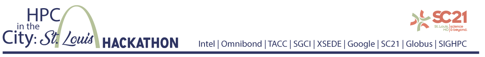

**Registration is **CLOSED**!

# Pre-Event Training Sessions
* **Mentor Training** - 9/30/21  (11am ET / 10am CT /8am PT)
  * [[Slides]](Training_Slides/Mentor%20Training.pdf) [[Mentor Mini-Hack Slide]](Training_Slides/Mentor%20Mini-Hack%20Slide.pdf) [[Video]](https://youtu.be/nOs3yW-ZlOg) 
* **How to Design a Data Project** [*SC21 Data Science Competition*](https://sc21.supercomputing.org/program/studentssc/data-science-competition/) - 10/5/21 (4pm ET / 3pm CT / 1pm PT)
  * [[Video]](https://youtu.be/Z9OYiRYvRJg) 
* **GitHub/Discord** - 10/7/21 (11am ET / 10am CT /8am PT)
 * * [[Slides]](Training_Slides/Discord%20and%20GitHub%20Training.pdf)  [[Video]](https://youtu.be/zoG9BrLTxQE) 
* **Google / CloudyCluster** - 10/14/21 (11am ET / 10am CT /8am PT)
 * * [[Slides]](Training_Slides/Google%20and%20CloudyCluster%20Training.pdf) [[Zoom Saved Chat Text]](Training_Slides/Zoom%20chat%20from%20Google%20and%20CloudyCluster%20Training.txt) [[Video]](https://youtu.be/0zEyMFndG5E)  
* **Data to Dashboard** - 10/21/21 (11am ET / 10am CT /8am PT)
  * * [[Slides]](Training_Slides/Data%20to%20Dashboard%20Training.pdf) [[Demo Github Repo]](https://github.com/mepearson/texas_congress) [[Demo Heroku Site]](https://texas-congress.herokuapp.com/) [[Video]](https://youtu.be/ZuTs5V-1CAk) 
* **Beginning to End Project Example** - 10/28/21 (11am ET / 10am CT /8am PT)

# Event Training Sessions
## Schedule of Events
Zoom connection details are directly sent to registered email addresses. If there is an issue [Please email us with your questions.](mailto:jpowell@tacc.utexas.edu,amycannon@omnibond.com,haydenl@mindspring.com?subject=[HPC-in-the-City-Zoom-Link-Problem])  

| Day | Time | Activities |
|-----------|:------------------------:|----------------------------|
| Thursday (11/4) | 6:00p(EST) 5:00p(CT) 3:00p(PT) |  **Kickoff Meeting**   • Dice-Breaker   • Ethics   • Schedule   • Google Project Setup   • Team Formation |
| Friday (11/5) | 11:00a(EST) 10:00a(CT) 8:00a(PT) |  **Checkin**   _Team Introductions_    &ensp; ‣ 1 Slide    &ensp; ‣ Team name    &ensp; ‣ Team members including Mentor    &ensp; ‣ Team Theme song    &ensp; ‣ Team Virtual background |
|  | 11:00a(EST) 10:00a(CT) 8:00a(PT) | **Judges Only Pre-Training Session** |
|  | 1:00p(EST) 12:00p(CT) 10:00a(PT) | **Data Carpentry Training Session** |
|  | 6:00p(EST) 5:00p(CT) 3:00p(PT) |  **Checkin**   _Team Goal Presentation_   &ensp; ‣ 1 Slide    &ensp; ‣ Team name    &ensp; ‣ Team members including Mentor   &ensp; ‣ Team Goal(s)   &ensp; ‣ at least 2 tasks to be completed by Saturday Evening Checkin|
| Saturday (11/6) | 11:00a(EST) 10:00a(CT) 8:00a(PT) |  **Checkin** |
|  | 6:00p(EST) 5:00p(CT) 3:00p(PT) |  **Checkin**   &ensp; ‣ _1 Day Progress Challenge_ |
| Sunday (11/7) | 12:30p(EST) 11:30a(CT) 9:30a(PT) |  **Checkin**  |
| Monday (11/8) | 11:00a(EST) 10:00a(CT) 8:00a(PT) |  **Checkin**   &ensp; ‣ Team Intro Videos by Mentors   &ensp; ‣ Presentation Reminders   &ensp; ‣ Viewer's Choice Voting Opens |
|  | 6:00p(EST) 5:00p(CT) 3:00p(PT) | **Team Presentations and Awards Ceremony**   &ensp; ‣ _Team Deliverables Due_   &ensp; ‣ YouTube Stream Opens |

---
# Additional Resources
## Github and MarkDown
* [GitHub Markdown Reference](https://github.github.com/gfm)  
* [Introduction to GitHub](https://lab.github.com/githubtraining/introduction-to-github)
* [Introduction to Version Control](https://swcarpentry.github.io/git-novice/)

## Google Cloud Platform and CloudyCluster
* [Qwiklabs - Credits](https://edu.google.com/programs/credits/training/?modal_active=none)
* [CloudyCluster Lab](https://www.cloudskillsboost.google/focuses/21221?parent=catalog)

## Data Management
* [R for Data Science](had.co.nz) - R for Data Science. Code in R / concepts useful any language
* [Tidy data for efficiency, reproducibility, and collaboration](openscapes.org) - Blog Overview (easy read) 
* [Tidy data Paper](had.co.nz) - Original paper by Hadley Wickham (founder of R) who pioneered the concept of tidy data
* [Tidy data • tidyr](tidyverse.org) - informal and example code heavy (in R) version

## Data Visualization
* [Chart Chooser — Juice Analytics](https://www.juiceanalytics.com/chartchooser)
* [Plotly graphing library](https://plotly.com/python/)

## Dash App
* [Dash App documentation](https://dash.plotly.com/)
* [Deploy to Heroku integration from github](https://devcenter.heroku.com/articles/github-integration)
* [Dash guidance / command line (scroll past Enterprise information to Heroku / free section](https://dash.plotly.com/deployment)
